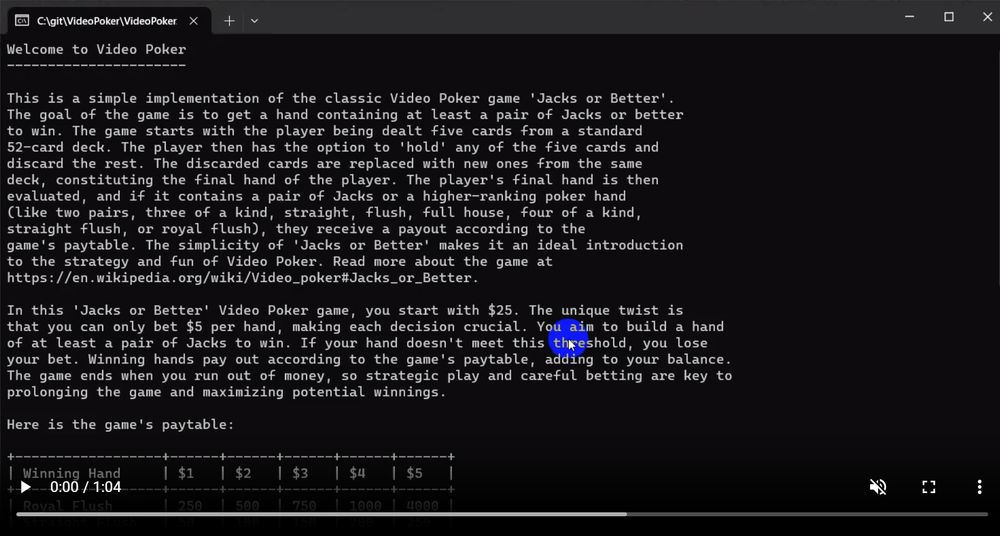

# VideoPoker

Denne opgave er en af de længere - en fuld (console) implementation af Video Poker (Jacks or better).

Start med at spille lidt Video Poker på [denne side](https://classicvideopoker.com/classicvideopoker/) og læs om [reglerne her](https://en.wikipedia.org/wiki/Video_poker#Jacks_or_Better).

Der er helt frit valg i måden at udvikle spillet på, men det skal som udgangspunkt være et konsolspil. Du kan dog sagtens lave en GUI hvis du har lyst til det.

Her er [en video der viser min implementation](https://s3.eu-west-1.amazonaws.com/media.cronberg.dk/cs/niveau3/videopoker.mp4) (prøv den selv eventuelt under /solution).

